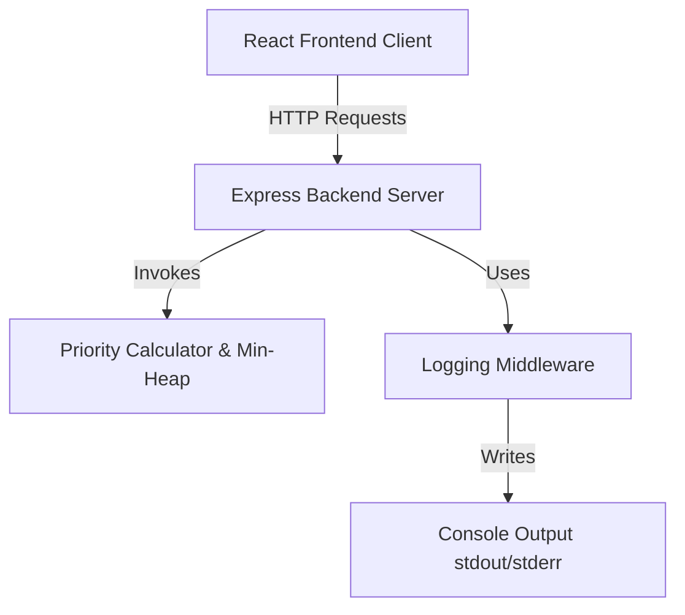

# Notification System Design (Stage 1)

This document describes the architectural layout, priority ranking mechanisms, complexity analysis, and future scalability paths for the Campus Notification System implemented in Stage 1.

---

## 1. System Architecture

The application is built using a clean, decoupled **Client-Server** architecture.



### Component Breakdown
*   **Frontend (React & Vite)**:
    *   Built using purely functional components.
    *   Interfaces with the API via the custom React Hook `useNotifications` and Fetch helpers.
    *   Styled with modular Vanilla CSS utilizing global design variables.
*   **Backend (Node.js & Express)**:
    *   Handles routing for main notifications and the Priority Inbox.
    *   Uses in-memory seeding for data, avoiding database overhead during Stage 1 evaluation.
*   **Logging Middleware**:
    *   Intercepts requests and errors (`requestLogger`, `errorLogger`).
    *   Provides a structured helper function (`logEvent`) for system-wide lifecycle logging.

---

## 2. Notification Flow

1.  **Boot & Seeding**: The server generates realistic notification seeds on startup, programmatically spreading dates to test sorting and decay logic.
2.  **API Requests**: 
    *   `GET /notifications`: Fetches all paginated notifications of a specified type, sorted by priority.
    *   `GET /notifications/priority-inbox`: Fetches the top 10 unread notifications.
3.  **Client Render**: 
    *   The frontend mounts `<NotificationsPage />`, which triggers API requests.
    *   Rendered components display read/unread states, pagination buttons, and a collapsible Priority Inbox.

---

## 3. Priority Scoring Algorithm

Each notification is assigned a numerical priority score computed as:

$$\text{Priority Score} = \text{Type Weight} + \text{Recency Score}$$

### 3.1 Type Weights
Weights are allocated based on student impact and actionability:
*   **Placement (100 pts)**: High urgency and career importance. Students must react immediately to registry deadlines.
*   **Result (60 pts)**: Important academic milestones. Crucial but does not require immediate, overnight action.
*   **Event (20 pts)**: Social and informational updates. Low urgency.

### 3.2 Recency Scoring
To ensure new notifications surface above older ones, recency adds up to $50$ points, decaying linearly over time:

$$\text{Recency Score} = \max(0, 50 - (\text{Age in Days} \times 5))$$

*   **Age = 0 days (Today)**: $+50$ points.
*   **Age = 2 days**: $+40$ points.
*   **Age = 10 days or older**: $+0$ points.

Thus, a newly posted *Result* (score $60 + 50 = 110$) will temporarily rank higher than a 10-day-old *Placement* drive ($100 + 0 = 100$).

---

## 4. Efficient Maintenance of Top 10

To handle a continuous stream of incoming notifications without degrading API performance, the Priority Inbox uses a **Min-Heap** bounded at size $K = 10$.

```
           [ Root: Min Score (e.g. 70) ]
                   /         \
                  /           \
           [Score: 85]     [Score: 90]
             /     \         /     \
          [...]   [...]   [...]   [...]
```

### Heap Mechanics
1.  Initialize an empty min-heap of maximum size $K=10$.
2.  For each incoming unread notification in the collection:
    *   If `heap.size < K`, immediately push the notification.
    *   If `heap.size == K`, compare the current notification's score against the root (`heap.min`).
    *   If the new notification's score is **greater** than the root's score, pop the root and push the new notification. Otherwise, discard it.
3.  Extract and sort the remaining $K$ elements in descending order for the API response.

---

## 5. Algorithmic Complexity

| Operation / Endpoint | Time Complexity | Space Complexity | Explanation |
| :--- | :--- | :--- | :--- |
| **Fetch Regular Feed** | $O(N \log N)$ | $O(N)$ | Sorts the filtered array of size $N$. |
| **Maintain Top 10 Inbox** | $O(N \log K)$ | $O(K)$ | Bounded heap processes $N$ elements. Since $K = 10$, this simplifies to $O(N)$ time and $O(1)$ space. |

---

## 6. Logging Middleware Integration

The application logs key events to track system behavior:

*   **Notification Fetch**: Logs endpoints accessed, page parameters, query types, and the count of items returned.
*   **Priority Calculation**: Logs when priority scores are computed, detailing the `typeWeight`, `recencyScore`, and `finalScore` for each item.
*   **Priority Ranking**: Logs the execution of sorting operations and heap tracking metrics.
*   **Incoming Notification Processing**: Logs during start-up seeding and client payload routing.
*   **API Errors**: Caught using `try/catch` and formatted by `errorLogger` with an `[ApiError]` tag.

---

## 7. Future Scalability

To transition this system to a production-grade service, the following components are recommended:

1.  **Persistence Layer**: Introduce a database (e.g., PostgreSQL) with indexes on `(type, isRead, createdAt)`.
2.  **Caching**: Store pre-calculated scores and Top 10 inbox feeds in Redis. Cache invalidation occurs only when notifications are marked read or new ones are added.
3.  **Decay Job**: Since recency decays daily, run a cron job or worker at midnight to refresh static priority scores in the cache.
4.  **WebSockets (SSE)**: Push real-time notifications to the client browser and update the Priority Inbox dynamically.
